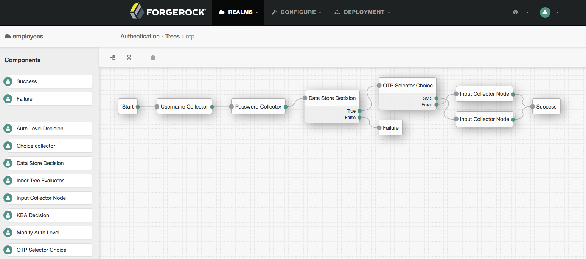
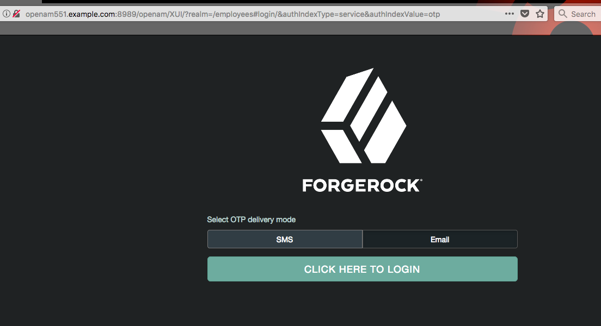

# OTPSelectorNode

* An authentication decision node which prompts with a choice to select OTP mode like Email, SMS etc  
 
Disclaimer of Liability :
=========================
The sample code described herein is provided on an "as is" basis, without warranty of any kind, to the fullest extent permitted by law. 
ForgeRock does not warrant or guarantee the individual success developers may have in implementing the sample code on their development platforms 
or in production configurations.

ForgeRock does not warrant, guarantee or make any representations regarding the use, results of use, accuracy, timeliness or completeness of any data 
or information relating to the sample code. ForgeRock disclaims all warranties, expressed or implied, and in particular, disclaims all warranties of 
merchantability, and warranties related to the code, or any service or software related thereto.

ForgeRock shall not be liable for any direct, indirect or consequential damages or costs of any type arising out of any action taken by you or others 
related to the sample code.
    
Pre-requisites :
================
* Versions used for this project: AM 5.5.1, DJ 5 
1. AM has been installed and configured.
2. Maven has been installed and configured. The code in this repository has binary dependencies that live in the ForgeRock maven repository. Maven can be configured to authenticate to this repository by following the following *[ForgeRock Knowledge Base Article.](https://backstage.forgerock.com/knowledge/kb/article/a74096897)*

AM Configuration:
=====================
1. Build custom authentication node by running "mvn clean install" in the directory containing the pom.xml. 
2. Copy the custom authentication node .jar file to WEB-INF/lib/ where AM is deployed. Refer instructions: *[Building and Installing Custom Authentication Modules](https://backstage.forgerock.com/docs/am/5.5/authentication-guide/#build-config-sample-auth-module)*
3. Restart the web container to pick up the new node. The node will then appear in the authentication trees components palette.
4. Create a new Authentication tree: otp 
5. Add required nodes in this tree, include OTPSelector node 

 
  
Testing:
======== 
* Authentication using otp tree
1. Invoke URL: http://openam551.example.com:8989/openam/XUI/?realm=/employees#login&service=otp 

* * *

The contents of this file are subject to the terms of the Common Development and
Distribution License (the License). You may not use this file except in compliance with the
License.

You can obtain a copy of the License at legal/CDDLv1.0.txt. See the License for the
specific language governing permission and limitations under the License.

When distributing Covered Software, include this CDDL Header Notice in each file and include
the License file at legal/CDDLv1.0.txt. If applicable, add the following below the CDDL
Header, with the fields enclosed by brackets [] replaced by your own identifying
information: "Portions copyright [year] [name of copyright owner]".

Copyright 2017 ForgeRock AS.